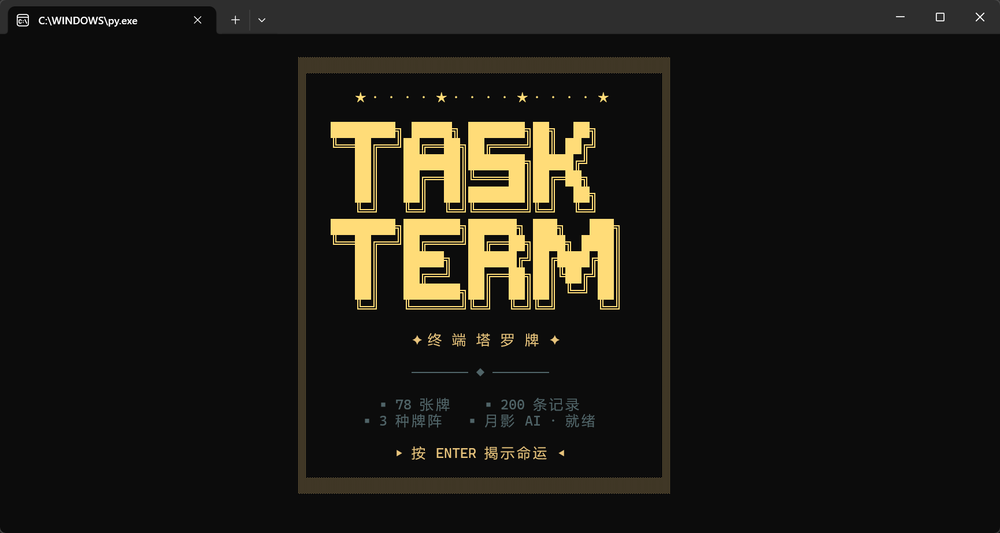
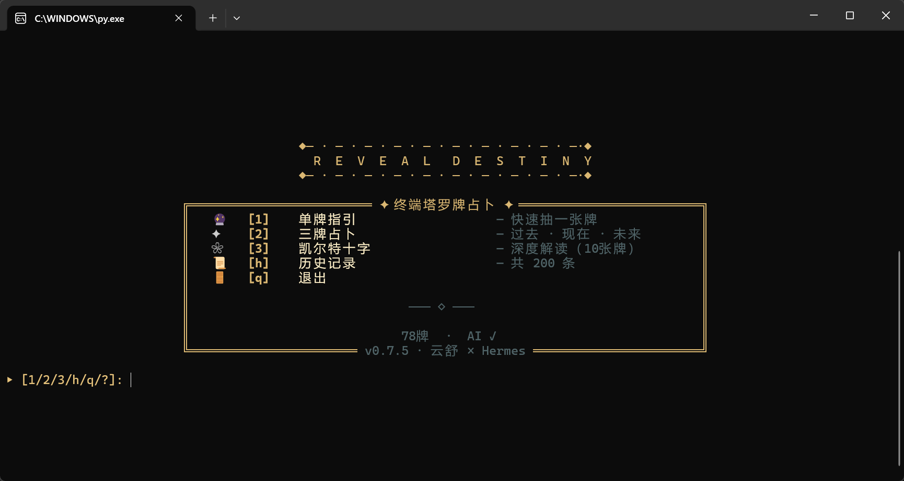

# 🔮 Terminal Tarot — 终端像素塔罗牌占卜

<p align="center">
  <strong>像素艺术 × 塔罗牌 × AI 解读</strong><br>
  在终端中体验神秘的塔罗牌占卜之旅
</p>

<p align="center">
  
  
  
  
</p>

---

## ✨ 特性

- 🎨 **像素艺术渲染** — ANSI 24-bit 真彩色半块字符，终端里的像素画
- 🃏 **78 张完整牌组** — Rider-Waite 传统，大阿尔克纳 + 小阿尔克纳
- 🔮 **三种牌阵** — 单牌指引、三牌占卜、凯尔特十字
- 🤖 **AI 智能解读** — DeepSeek API，「月影」占卜师人格
- 📜 **占卜历史** — 自动记录每次占卜结果
- ⌨️ **键盘驱动** — Rich + prompt_toolkit，流畅的 TUI 体验

## 📸 截图

<p align="center">
  
</p>

<p align="center">
  
</p>

## 🚀 快速开始

### 安装

```bash
# 克隆仓库
git clone https://github.com/SaltedFish-ZZJ/terminal-tarot.git
cd terminal-tarot

# 安装依赖
pip install -e .
```

### 运行

```bash
# 交互模式
python main.py

# 跳过开机动画
python main.py --skip-boot

# 测试渲染愚者卡
python main.py --test

# 查看版本
python main.py --version
```

### 命令行入口

安装后可直接使用 `tarot` 命令：

```bash
tarot              # 启动交互模式
tarot --help       # 查看帮助
```

## ⌨️ 快捷键

| 按键 | 功能 |
|:---:|:---|
| `ESC` | 返回上一级菜单 |
| `S` | 跳过翻牌动画 |
| `R` | 重新占卜 |
| `H` | 查看历史记录 |
| `?` | 显示帮助 |

## 🤖 AI 解读配置

本项目支持 DeepSeek API 进行智能塔罗解读。

1. 注册 [DeepSeek](https://platform.deepseek.com/) 账号，获取 API Key
2. 复制配置模板：
   ```bash
   cp .env.example .env
   ```
3. 编辑 `.env`，填入你的 Key：
   ```
   TAROT_AI_API_KEY=your_api_key_here
   ```

> **提示**：无 API Key 时自动使用离线基础解读，无需配置也能体验完整功能。

## 🏗️ 项目结构

```
terminal-tarot/
├── main.py              # 入口文件
├── tarot/
│   ├── __init__.py      # 版本信息
│   ├── app.py           # 主应用逻辑
│   ├── tui.py           # TUI 引擎
│   ├── renderer.py      # 像素渲染器
│   ├── ai_reader.py     # AI 解读模块
│   ├── deck.py          # 78 张塔罗牌数据
│   ├── spreads.py       # 牌阵定义
│   ├── animations.py    # 动画效果
│   ├── style.py         # 样式常量
│   ├── log.py           # 历史记录
│   └── cards/           # 像素画数据
├── tests/               # 测试用例
├── data/                # 卡牌数据
└── docs/                # 开发文档
```

## 🛠️ 技术栈

- **Python 3.10+** — 运行环境
- **Rich** — 终端格式化与渲染
- **prompt_toolkit** — 键盘输入处理
- **httpx** — HTTP 客户端
- **DeepSeek API** — AI 解读服务

## 🧪 测试

```bash
# 运行全部测试
python -m pytest tests/ -v

# 运行特定测试
python -m pytest tests/test_deck.py -v
```

## 📄 License

[MIT License](LICENSE)

## 🙏 致谢

- [Rider-Waite Tarot](https://en.wikipedia.org/wiki/Rider%E2%80%93Waite_tarot_deck) — 经典塔罗牌图案
- [Rich](https://github.com/Textualize/rich) — 终端格式化库
- [DeepSeek](https://deepseek.com/) — AI 服务提供商

---

<p align="center">
  <em>✨ 愿星光照亮你的命运之路 ✨</em>
</p>
